# Panduan E2E Test — Diskusi Mahasiswa (Chat)

Uji ujung-ke-ujung alur diskusi kelompok mahasiswa di **kolabri.web.id**, dari login sampai ringkasan AI. Cocok untuk smoke test rilis atau bukti penggunaan di user manual.

**Akun demo:**

| Peran | Email | Password |
|---|---|---|
| Mahasiswa | `andi.pratama@student.ac.id` | `password123` |

**Estimasi waktu:** ±3 menit. **Prasyarat:** kelas dengan grup (contoh: IF203 Algoritma dan Struktur Data — Andi tergabung di "Kelompok A").

---

## 1. Login

Buka `https://kolabri.web.id/login`, masukkan akun mahasiswa, klik **Masuk**.

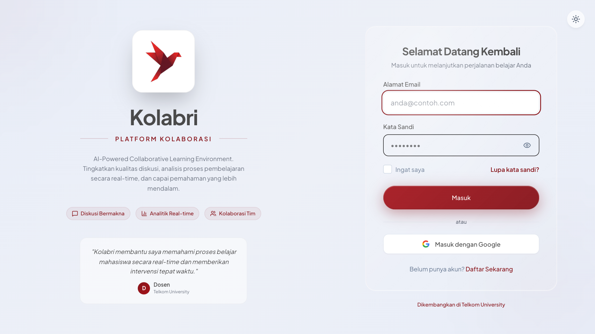

## 2. Pilih kelas di "Kelas Saya"

Halaman menampilkan daftar kelas yang diikuti. Klik **Lihat Kelas** pada kelas uji.

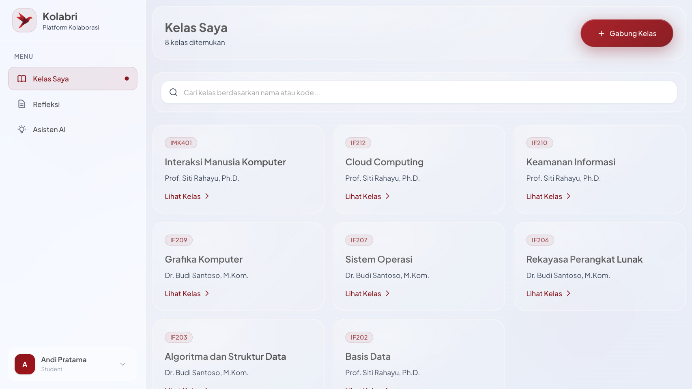

## 3. Detail kelas — Grup & Sesi Diskusi

Pastikan:
- bagian **Grup** menampilkan kelompok beserta anggota dan kode grup,
- bagian **Sesi Diskusi** menampilkan daftar sesi (status *Terbuka* / *Ditutup*).

Klik **Sesi Baru** untuk membuat sesi diskusi.

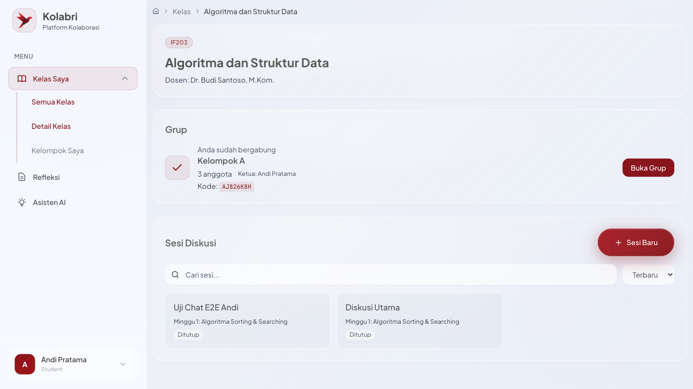

## 4. Buat sesi diskusi baru

Isi **Nama Sesi** dan pilih **Minggu kuliah**, lalu klik **Buat Sesi**.

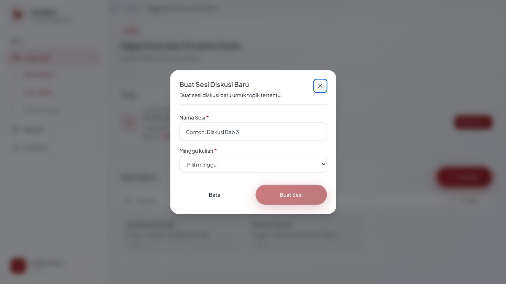

## 5. Pre-read (bacaan sebelum diskusi)

Sistem mengarahkan ke halaman pre-read: tinjau materi minggu ini, lalu klik **Lanjut ke tujuan pembelajaran**.

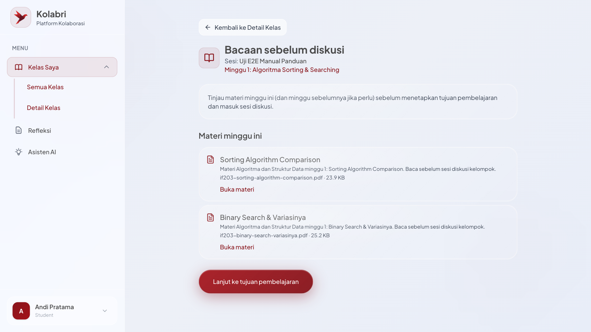

## 6. Tetapkan tujuan belajar kelompok

Pilih kata kerja aksi (Taksonomi Bloom) dan tulis tujuan yang **spesifik dan punya batas waktu**.

> ⚠️ **Validasi aktif:** tujuan tanpa komponen waktu akan **ditolak (400)** dengan pertanyaan balik dari AI, mis. *"Kapan tepatnya sesi kelompok itu dijadwalkan…?"*. Contoh yang lolos: *"...sebelum sesi berakhir"*, *"...dalam 60 menit"*.

Klik **Tetapkan Tujuan & Mulai Diskusi**.

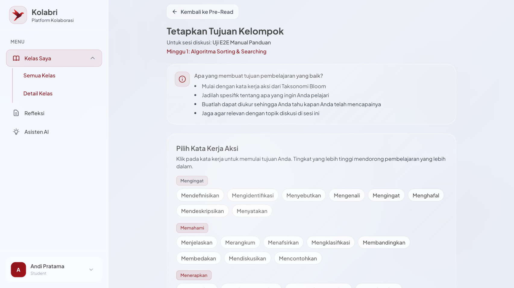

## 7. Ruang chat — kirim pesan

Ruang chat terbuka: tujuan sesi, anggota, materi diskusi, dan panel sitasi AI tampil di sidebar. Ketik pesan lalu klik **Kirim** (atau Enter).

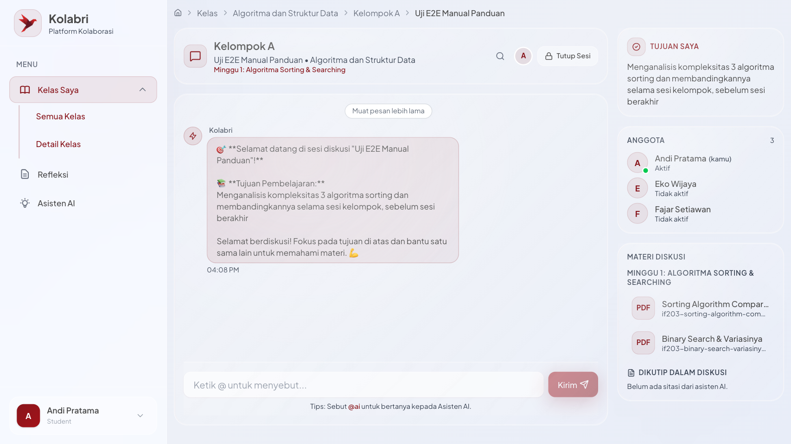

Pesan tampil dengan nama pengirim dan waktu. Muat ulang halaman untuk memastikan **pesan tersimpan** (persistensi).

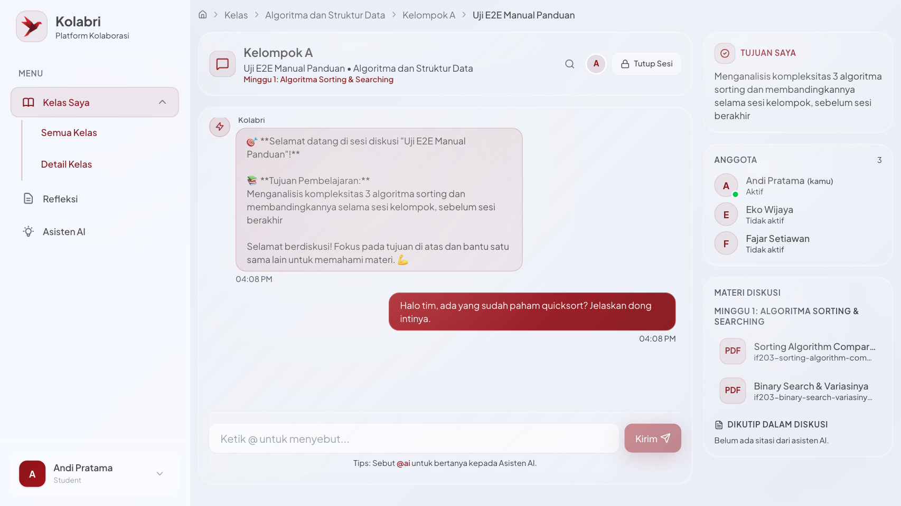

## 8. Minta bantuan Asisten AI dengan `@ai`

Ketik `@ai <pertanyaan>` lalu **Kirim**. Asisten AI membalas di ruang diskusi (respons streaming, biasanya5–20 detik).

Balasan AI jujur soal sumber: jika tidak ada materi kelas yang relevan, ia menyebutkannya dan menjawab dari pengetahuan umum — bukan mengarang sitasi.

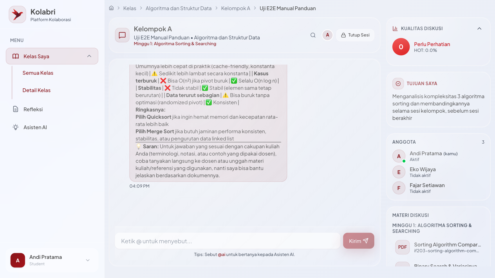

## 9. Tutup sesi

Klik **Tutup Sesi** di header ruang chat, konfirmasi dengan **Ya, Tutup Sesi**. Setelah ditutup, input pesan menjadi nonaktif (*"Sesi telah ditutup"*).

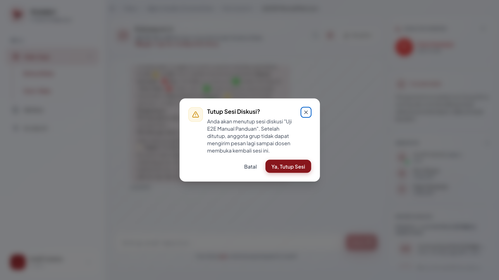

## 10. Ringkasan diskusi (AI)

Setelah sesi ditutup, **Ringkasan Diskusi** dibuat otomatis oleh AI dalam **±15 detik**.

> 💡 Biarkan halaman terbuka sampai ringkasan muncul — **jangan di-reload** di masa transisi (lihat Catatan B4 di bawah).

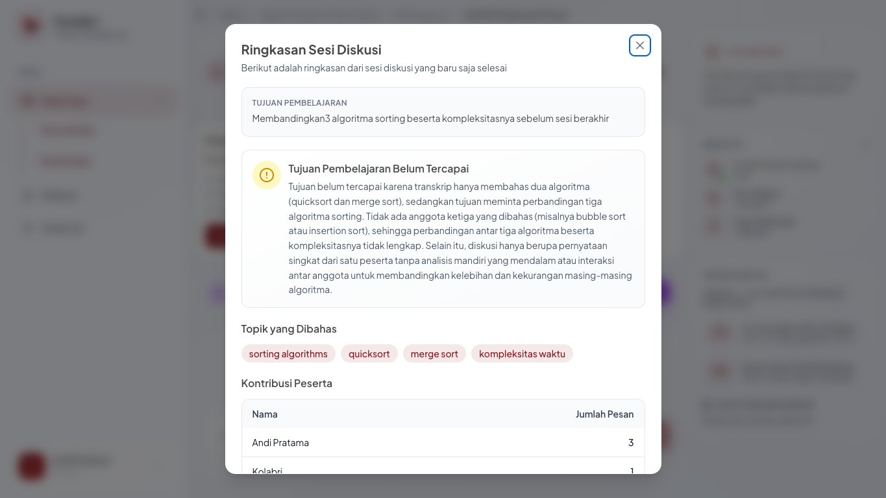

## 11. Isi refleksi

Klik **Isi Refleksi**, tulis pembelajaran selama sesi, lalu **Kirim Refleksi**.

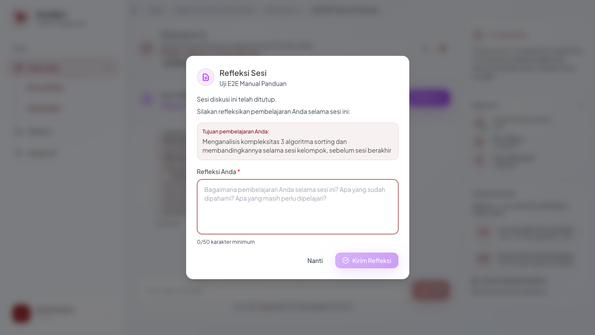

---

## Checklist hasil yang diharapkan

| # | Langkah | Tanda lulus |
|---|---|---|
|1| Login | masuk ke `/student/courses`, nama akun tampil |
|2| Pilih kelas | daftar kelas + status "8 kelas ditemukan" |
|3| Sesi Baru | modal buat sesi muncul |
|4| Buat sesi | redirect ke halaman pre-read |
|5| Pre-read → tujuan | redirect ke halaman tujuan |
|6| Tujuan SMART | lolos; tujuan tanpa waktu → **400 + pesan AI** |
|7| Kirim pesan | pesan tampil + bertahan setelah reload |
|8| `@ai` | balasan "Asisten AI" masuk (log engine: `POST /api/chat/stream … 200`) |
|9| Tutup sesi | status "Sesi Ditutup", input disabled |
|10| Ringkasan | section "Ringkasan Diskusi" berisi rangkuman akurat ±15 dtk |
|11| Refleksi | `POST /reflection → 201`, gate refleksi hilang |

## Catatan & troubleshooting

- **A. Sesi sudah "Ditutup"** — status normal; pesan hanya-baca. Buat sesi baru lewat **Sesi Baru** untuk uji kirim.
- **B. Tujuan ditolak400** — bukan error server; lengkapi komponen waktu pada tujuan (validasi AI goal).
  - **B1.** Klik ganda saat submit tujuan menghasilkan `POST /api/goals` kedua yang400 (duplikat) — tunggu navigasi.
  - **B2.** Balasan `@ai` bisa >20 detik tergantung beban provider.
  - **B3.** Ringkasan "Belum cukup pesan untuk membuat ringkasan" bila pesan terlalu sedikit (≤2) — kirim ≥3 pesan dulu.
  - **B4. (diketahui,2026-10-04)** Ringkasan tersimpan di DB tapi **tidak tampil setelah reload halaman** (halaman tidak mem-fetch ulang summary; hanya render saat sesi baru ditutup). **Workaround:** jangan reload, tunggu ringkasan muncul di halaman yang sama. (Laporkan ke backlog bila mau diperbaiki.)
- **C. Gerbang pre-read & tujuan** — mahasiswa wajib menyelesaikan keduanya sebelum masuk ruang chat; jika diarahkan balik, ulangi langkah5–6.
